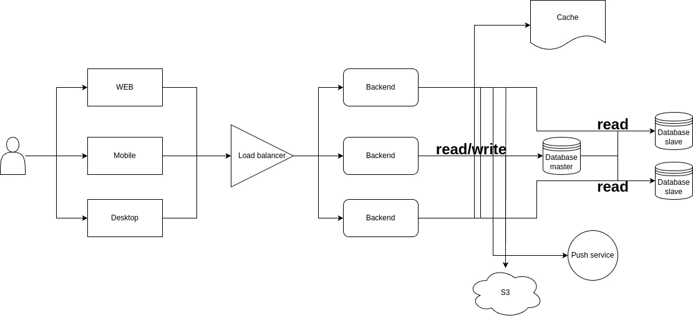

 

## Расчёт
В задаче не указано, какую кодировку использует сервис, но я предпологаю, что это UTF-8, тогда каждый символ весит один байт. По верхней планке выходит, что один пользователь может сгененрировать 10 * (2000 * 8) = 20 килобайт за один день без учёта картинок. Трудно предсказать, сколько пользователь будет загружать картинок в день в среднем, но я предположу, что это будет 10 картинок. Это 10 мегабайт. \
200 000 000 * (10 + 0.02) = 2004 терабайт в день генерируют уникальные пользователи, это нагрузка на запись.

Поскольку в условиях указано, что пользователь в среднем пользователь просматривает сообщений в два раза больше, чем пишет, то буду отталикиваться от этих значений и просто увеличу нагрузку на чтение в двое. Это 4008 терабайт в день.

Может показаться, что это огромная нагрузка на базу данных, но стоит учитывать, что большая часть этих данных - это картинки, и основная нагрузка придёт на S3 сервис. На базу данных же нагрузка будет выглядить 200 000 000 * 0.02 = 4 терабайта в день на запись и 8 терабайт в день на чтение. \

Чтобы выяснить общее количество запросов, надо сложить количество запросов на чтение и запись. Это будет (200 000 000 * 10) + (200 000 000  * 20) = 6000000000 запросов в сутки. Rps - 6000000000 / (24 * 60 * 60) = 69,444.44. Rpm - 6000000000 / (24 * 60) = 4,166,666.67.

## API
 - Отправка сообщения
 - Получение сообщения 
 - Синхронизация клиентов (многосоставная операция)
 - Создание чата
 - Удаление чата
 - Добавление в чат пользователей (при правах владельца чата)
 - Удаление из чата пользователей (при правах владельца чата)
 - Последняя временная метка, когда пользователь был доступен
 - Соединение с сервером (здесь же устанавливается, что пользователь в онлайне)
 - Разрыв соединения с сервером (здесь же устанавливается, что пользователь в оффлайне)

## Модель данных
### Users

| Поле         | Тип данных       | Ограничения                  | Описание                       |
|--------------|------------------|------------------------------|--------------------------------|
| `id`         | INTEGER          | PRIMARY KEY, AUTO_INCREMENT  | Уникальный идентификатор       |
| `username`   | VARCHAR(255)     | NOT NULL, UNIQUE             | Имя пользователя               |
| `phone`      | INTEGER          | NOT NULL, UNIQUE             | Номер мобильного телефона      |
| `created_at` | TIMESTAMP        | DEFAULT CURRENT_TIMESTAMP    | Дата и время создания записи   |
| `updated_at` | TIMESTAMP        | DEFAULT CURRENT_TIMESTAMP    | Дата и время обновления записи |

### Chats

| Поле         | Тип данных       | Ограничения                  | Описание                       |
|--------------|------------------|------------------------------|--------------------------------|
| `id`         | INTEGER          | PRIMARY KEY, AUTO_INCREMENT  | Уникальный идентификатор       |
| `title`      | VARCHAR(255)     | NOT NULL                     | Название чата                  |
| `created_at` | TIMESTAMP        | DEFAULT CURRENT_TIMESTAMP    | Дата и время создания записи   |
| `updated_at` | TIMESTAMP        | DEFAULT CURRENT_TIMESTAMP    | Дата и время обновления записи |

### ChatUsers

| Поле         | Тип данных       | Ограничения                     | Описание                       |
|--------------|------------------|---------------------------------|--------------------------------|
| `id`         | INTEGER          | PRIMARY KEY, AUTO_INCREMENT     | Уникальный идентификатор       |
| `chat_id`    | INTEGER          | FOREIGN KEY REFERENCES Chats(id)| Идентификатор чата             |
| `user_id`    | INTEGER          | FOREIGN KEY REFERENCES Users(id)| Идентификатор пользователя     |
| `created_at` | TIMESTAMP        | DEFAULT CURRENT_TIMESTAMP       | Дата и время создания записи   |
| `updated_at` | TIMESTAMP        | DEFAULT CURRENT_TIMESTAMP       | Дата и время обновления записи |

### Messages

| Поле         | Тип данных       | Ограничения                     | Описание                       |
|--------------|------------------|---------------------------------|--------------------------------|
| `id`         | INTEGER          | PRIMARY KEY, AUTO_INCREMENT     | Уникальный идентификатор       |
| `content`    | TEXT             | NOT NULL                        | Содержимое сообщения           |
| `chat_id`    | INTEGER          | FOREIGN KEY REFERENCES Chats(id)| Идентификатор чата             |
| `user_id`    | INTEGER          | FOREIGN KEY REFERENCES Users(id)| Идентификатор пользователя     |
| `created_at` | TIMESTAMP        | DEFAULT CURRENT_TIMESTAMP       | Дата и время создания записи   |
| `updated_at` | TIMESTAMP        | DEFAULT CURRENT_TIMESTAMP       | Дата и время обновления записи |